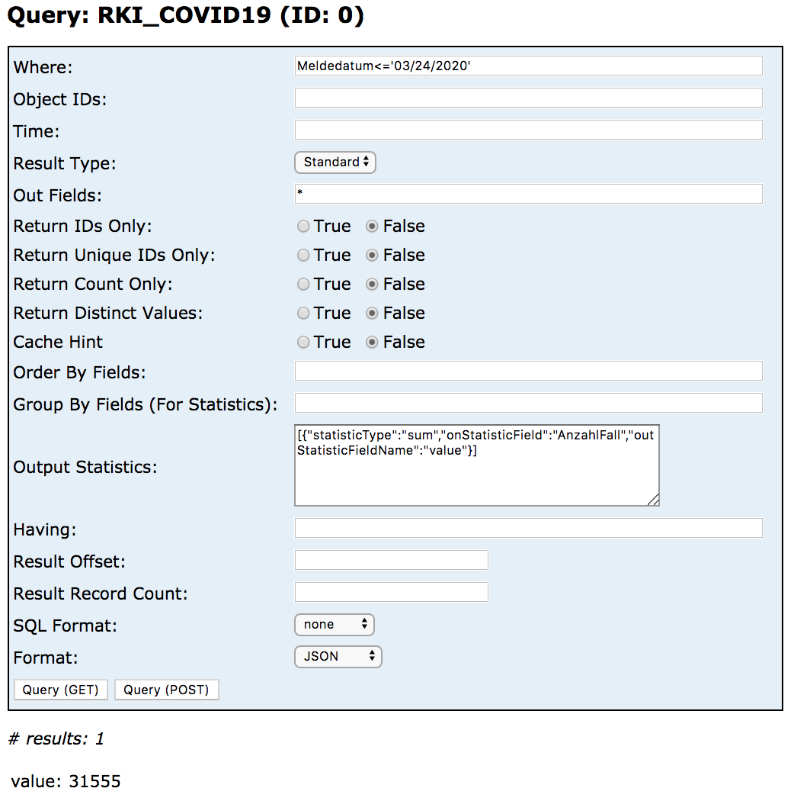

## RKI-WRAPPER

Der RKI-Wrapper greift auf die API des Robert Koch-Instituts zu und gibt die ausgelieferten Daten in einer für Datawrapper geeigneten Form zurück.

Der Wrapper holt in einer einzelnen Anfrage die Daten bis zum gewählten End-Datum gemeldeten Fälle und aggregiert die Fallzahlen pro Tag und wahlweise nach weiteren Feldern, wie Altersgruppe oder Landkreis. Im Anschluss berechnet er die kumulative Summe der Fallzahlen vom ersten Meldetag an (=2020-01-24).

*Hinweis:* Um herauszufinden, welche Werte man in die Felder einsetzen kann, lohnt sich ein Blick in den [Überblick der Daten](https://npgeo-corona-npgeo-de.hub.arcgis.com/datasets/dd4580c810204019a7b8eb3e0b329dd6_0/data).

### Beispiel

```text
https://europe-west3-brdata-niels.cloudfunctions.net/rkiApi/query?
  format=csv&
  group=Bundesland&bundesland=Bayern,Baden-Württemberg
```

### Parameter

-	`startDate` *| optional | Default: '2020-01-24' (= erster Tag, den das RKI liefert)*: Gibt an, ab welchem Tag der Wrapper Daten zurück gibt. *Hinweis:* Die aggregierten Fallzahlen enthalten auch weiter zurückliegende Fälle als `fromDate`.

-	`endDate` *| optional | Default: aktuelles Datum*: Gibt an, bis zu welchem Tag der Wrapper Daten zurück gibt.

-	`group` *| optional*: Gibt an, nach welchem Feld aggregiert wird. *Hinweis:* Bis jetzt nur einzelene Felder wählbar, z.B. `group=Geschlecht`

-	`format` *| optional | Default: json*: Wählt das Ausgabeformat. *Hinweis:* Für Datawrapper wähle `format=csv`.

-	`geschlecht`, `altersgruppe`, `bundesland`, `landkreis` *| optional*: Filtert die entsprechenden Felder. Mehrfachauswahl ist möglich, z.B. gibt `bundesland=Bayern&geschlecht=M` die Anzahl der gemeldeten infizierten Männer in Bayern zurück. Mehrfachauswahl innerhalb der Felder ist auch möglich, z.B. `landkreis=SK München,Sk Hamburg`. 

	- Bei Mehrfachauswahl innerhalb eines Feldes sind die Werte mit `,` ohne Leerzeichen anzugeben
	
	- Die Filter-Keys sind in Kleinbuchstaben anzugenben, z.B. `bundesland`
	
	- Alle Werte sind ohne Anführungszeichen anzugeben
	
	- - *Hinweis:* Die verschiedenen Filterfelder sind mit logischem `AND` verknüpft. Mehrfachauswahl innerhalb eines Feldes ist mit `OR`
verknüpft.

	- *Hinweis:* Ergänzend zur Filterung ist es fast immer sinnvoll auch den Parameter `group` mit einem der Filterfelder zu besetzen
	
	- *Hinweis:* Abweichung der Schreibweise macht den Filter wirkungslos
 


## RKI-API

RKI: <https://experience.arcgis.com/experience/478220a4c454480e823b17327b2bf1d4>

## Einzelne Fälle

```text
https://services7.arcgis.com/mOBPykOjAyBO2ZKk/arcgis/rest/services/RKI_COVID19/FeatureServer/0/query?
  f=json&
  where=Meldedatum%3Etimestamp%20%272020-03-01%2022%3A59%3A59%27&
  returnGeometry=false&
  spatialRel=esriSpatialRelIntersects&
  outFields=ObjectId%2CAnzahlFall%2CMeldedatum%2CNeuerFall&
  orderByFields=Meldedatum%20asc&
  resultOffset=12000&
  resultRecordCount=2000&
  cacheHint=true
```

Was bewirkt `resultOffset`?

## Aggregierte Fälle pro Bundesland

```text
https://services7.arcgis.com/mOBPykOjAyBO2ZKk/arcgis/rest/services/Coronaf%C3%A4lle_in_den_Bundesl%C3%A4ndern/FeatureServer/0/query?
  f=json&
  where=1%3D1&
  returnGeometry=false&
  spatialRel=esriSpatialRelIntersects&
  outFields=*&
  orderByFields=Fallzahl%20desc&
  outSR=102100&
  resultOffset=0&
  resultRecordCount=25&
  cacheHint=true
```

```text
https://services7.arcgis.com/mOBPykOjAyBO2ZKk/arcgis/rest/services/Coronaf%C3%A4lle_in_den_Bundesl%C3%A4ndern/FeatureServer/0/query?
  f=json&where=1%3D1&
  returnGeometry=false&
  spatialRel=esriSpatialRelIntersects&
  outFields=*&
  groupByFieldsForStatistics=LAN_ew_GEN&
  orderByFields=value%20desc&
  outStatistics=%5B%7B%22statisticType%22%3A%22max%22%2C%22onStatisticField%22%3A%22faelle_100000_EW%22%2C%22outStatisticFieldName%22%3A%22value%22%7D%5D&
  cacheHint=true
```

Was bewirkt `outStatistics`?

## Fälle nach Altergruppe und Geschlecht (Deutschland)

```text
https://services7.arcgis.com/mOBPykOjAyBO2ZKk/arcgis/rest/services/RKI_COVID19/FeatureServer/0/query?
  f=json&
  where=Geschlecht%3C%3E%27unbekannt%27%20AND%20Altersgruppe%3C%3E%27unbekannt%27&
  returnGeometry=false&
  spatialRel=esriSpatialRelIntersects&
  outFields=*&
  groupByFieldsForStatistics=Altersgruppe%2CGeschlecht&
  orderByFields=Altersgruppe%20asc&
  outStatistics=%5B%7B%22statisticType%22%3A%22sum%22%2C%22onStatisticField%22%3A%22AnzahlFall%22%2C%22outStatisticFieldName%22%3A%22value%22%7D%5D&
  cacheHint=true
```

Was bewirkt `outStatistics`?

## Fälle pro 100.000 Einwohner (Bundesländer)

```text
https://services7.arcgis.com/mOBPykOjAyBO2ZKk/arcgis/rest/services/Coronaf%C3%A4lle_in_den_Bundesl%C3%A4ndern/FeatureServer/0/query?f=json&where=1%3D1&returnGeometry=false&spatialRel=esriSpatialRelIntersects&outFields=*&groupByFieldsForStatistics=LAN_ew_GEN&orderByFields=value%20desc&outStatistics=%5B%7B%22statisticType%22%3A%22max%22%2C%22onStatisticField%22%3A%22faelle_100000_EW%22%2C%22outStatisticFieldName%22%3A%22value%22%7D%5D&cacheHint=true
```

## Aggregiert Anzahl der Infizierten (Deutschland)

```text
https://services7.arcgis.com/mOBPykOjAyBO2ZKk/arcgis/rest/services/Coronaf%C3%A4lle_in_den_Bundesl%C3%A4ndern/FeatureServer/0/query?f=json&where=1%3D1&returnGeometry=false&spatialRel=esriSpatialRelIntersects&outFields=*&outStatistics=%5B%7B%22statisticType%22%3A%22sum%22%2C%22onStatisticField%22%3A%22Fallzahl%22%2C%22outStatisticFieldName%22%3A%22value%22%7D%5D&outSR=102100&cacheHint=true
```

## Aggregierte Anzahl der Neuinfizierten (Deutschland)

```text
https://services7.arcgis.com/mOBPykOjAyBO2ZKk/arcgis/rest/services/RKI_COVID19/FeatureServer/0/query?f=json&where=NeuerFall%3D1&returnGeometry=false&spatialRel=esriSpatialRelIntersects&outFields=*&outStatistics=%5B%7B%22statisticType%22%3A%22sum%22%2C%22onStatisticField%22%3A%22AnzahlFall%22%2C%22outStatisticFieldName%22%3A%22value%22%7D%5D&cacheHint=true
```

```text
https://services7.arcgis.com/mOBPykOjAyBO2ZKk/arcgis/rest/services/RKI_COVID19/FeatureServer/0/query?
where=Meldedatum%3C%3D%2703%2F24%2F2020%27&
outStatistics=%5B%7B%22statisticType%22%3A%22sum%22%2C%22onStatisticField%22%3A%22AnzahlFall%22%2C%22outStatisticFieldName%22%3A%22value%22%7D%5D&having=&
f=pjson
```

Über den Parameter `where` kann nach Datum gefiltert werden. `where=Meldedatum%3C%3D%2703%2F24%2F2020%27` steht für `Meldedatum<='03/24/2020'` - also alle Fälle bis einschließlich 24.03.2020.  

Über den Parameter `outStatistics` kann man die Fälle summieren.

Außerdem kann man hier nach Bundesland, Landkreis, Geschlecht, etc. filtern oder aggregieren.

Siehe [API Explorer](https://services7.arcgis.com/mOBPykOjAyBO2ZKk/arcgis/rest/services/RKI_COVID19/FeatureServer/0/query?where=Meldedatum%3C%3D%2703%2F24%2F2020%27&objectIds=&time=&resultType=standard&outFields=*&returnIdsOnly=false&returnUniqueIdsOnly=false&returnCountOnly=false&returnDistinctValues=false&cacheHint=false&orderByFields=&groupByFieldsForStatistics=&outStatistics=%5B%7B%22statisticType%22%3A%22sum%22%2C%22onStatisticField%22%3A%22AnzahlFall%22%2C%22outStatisticFieldName%22%3A%22value%22%7D%5D&having=&resultOffset=&resultRecordCount=&sqlFormat=none&f=html),
[Metadaten](https://services7.arcgis.com/mOBPykOjAyBO2ZKk/ArcGIS/rest/services/RKI_COVID19/FeatureServer/0)



## Aggregierte Anzahl der Todesfälle (Deutschland)

```text
https://services7.arcgis.com/mOBPykOjAyBO2ZKk/arcgis/rest/services/Coronaf%C3%A4lle_in_den_Bundesl%C3%A4ndern/FeatureServer/0/query?f=json&where=1%3D1&returnGeometry=false&spatialRel=esriSpatialRelIntersects&outFields=*&outStatistics=%5B%7B%22statisticType%22%3A%22sum%22%2C%22onStatisticField%22%3A%22Death%22%2C%22outStatisticFieldName%22%3A%22value%22%7D%5D&cacheHint=true
```

## Aggregierte Anzahl der neuen Todesfälle (Deutschland)

```text
https://services7.arcgis.com/mOBPykOjAyBO2ZKk/arcgis/rest/services/RKI_COVID19/FeatureServer/0/query?f=json&where=NeuerTodesfall%3D1&returnGeometry=false&spatialRel=esriSpatialRelIntersects&outFields=*&outStatistics=%5B%7B%22statisticType%22%3A%22sum%22%2C%22onStatisticField%22%3A%22AnzahlTodesfall%22%2C%22outStatisticFieldName%22%3A%22value%22%7D%5D&cacheHint=true
```
